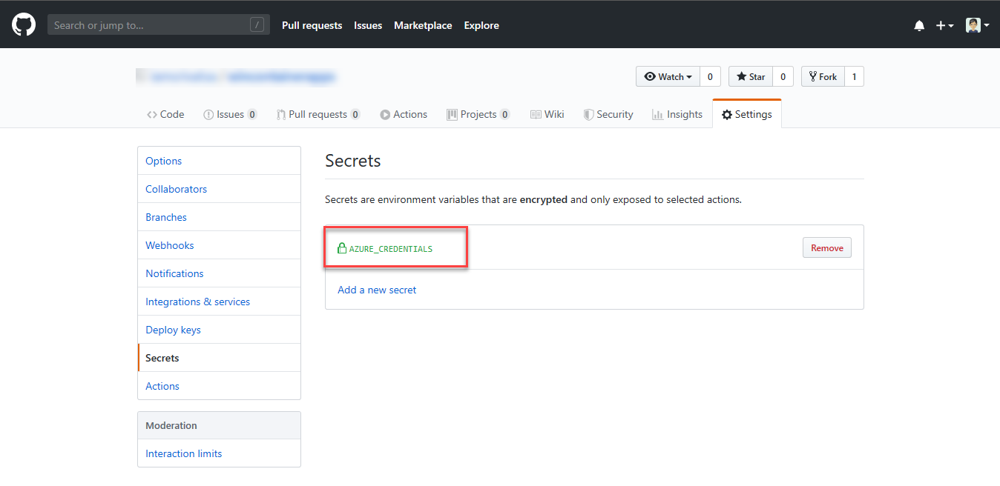
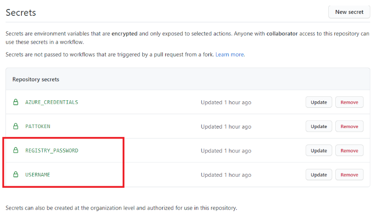
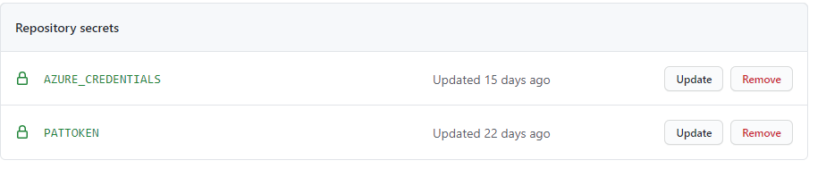

# Template Workflow to deploy a ACR image to AKS using event grid

The workflows in this repo show how to deploy any image from azure container registery to azure kubernetes cluster using event grid subscription to container registery.
Based on the events trigerred the corresponding workflow will be trigerred.
- Workflow 1- subscribe to ACR -->create image and push to ACR which will trigger image-push event in event grid.
- Workflow 2- the image pushed to ACR is deployed to AKS. 

# Getting started

### 1. Prerequisites

The following prerequisites are required to make this repository work:
- Azure subscription
- Contributor access to the Azure subscription
- Resource group created on azure portal
- Azure container registery resource created in the resource group
- Azure kubernetes cluster service created in the resource group

### 2. Create repository

To get started with ML Ops, simply create a new repo based off this template, by clicking on the green "Use this template" button:

<p align="center">
  
</p>

### 3. Setting up the required secrets
#### To allow GitHub Actions to access Azure
An [Azure service principal](https://docs.microsoft.com/en-us/azure/active-directory/develop/app-objects-and-service-principals) needs to be generated. Just go to the Azure Portal to find the details of your resource group. Then start the Cloud CLI or install the [Azure CLI](https://docs.microsoft.com/en-us/cli/azure/install-azure-cli?view=azure-cli-latest) on your computer and execute the following command to generate the required credentials:

```sh
# Replace {service-principal-name}, {subscription-id} and {resource-group} with your 
# Azure subscription id and resource group name and any name for your service principle
az ad sp create-for-rbac --name {service-principal-name} \
                         --role contributor \
                         --scopes /subscriptions/{subscription-id}/resourceGroups/{resource-group} \
                         --sdk-auth
```

This will generate the following JSON output:

```sh
{
  "clientId": "<GUID>",
  "clientSecret": "<GUID>",
  "subscriptionId": "<GUID>",
  "tenantId": "<GUID>",
  (...)
}
```

Add this JSON output as [a secret](https://help.github.com/en/actions/configuring-and-managing-workflows/creating-and-storing-encrypted-secrets#creating-encrypted-secrets) with the name `AZURE_CREDENTIALS` in your GitHub repository:

<p align="center">
  
</p>

To do so, click on the Settings tab in your repository, then click on Secrets and finally add the new secret with the name `AZURE_CREDENTIALS` to your repository.

Please follow [this link](https://help.github.com/en/actions/configuring-and-managing-workflows/creating-and-storing-encrypted-secrets#creating-encrypted-secrets) for more details. 


#### Credentials required to push/pull to azure container registry
Following secrets are credentials required to access azure container registry.
- REGISTRY_PASSWORD
- USERNAME

These can be set using the azure credentials generated above-
- REGISTRY_PASSWORD will be value of "password" from the azure credentials generated.
- USERNAME will be value of "clientId" from the azure credentials generated.

These secrets will be added as shown below-
<p align="center">
  
</p>

#### To Allow Azure to trigger a GitHub Workflow
 We also need GH PAT token with `repo` access so that we can trigger a GH workflow when the training is completed on Azure Machine Learning. 
 
 <p align="center">
  
</p>
 
 Add the PAT token with as [a secret](https://help.github.com/en/actions/configuring-and-managing-workflows/creating-and-storing-encrypted-secrets#creating-encrypted-secrets) with the name `PATTOKEN` in your GitHub repository:
 <p align="center">
  
</p>

### 4. Define your workflow parameters

We have precreated a [Workflow PushImage](/.github/workflows/PushImage.yml) that creates an event grid subscription to our Azure Container Registry ,then pushes an image to this registry. 

You need to update the workflow files [Workflow PushImage](/.github/workflows/PushImage.yml) and [Workflow deploy_image](/.github/workflows/deploy_image.yml) with the below parameters wherever required-
-ACR name(both worflows)
-Resource group name(both workflows)
-AKS cluster name (only to be updated in [Workflow deploy_image](/.github/workflows/deploy_image.yml))
-tag filter(only to be updated in [Workflow deploy_image](/.github/workflows/deploy_image.yml)
  This will only allow the images with matching tag to be deployed to kubernetes.
  
After updating secrets and workflow parameters changes can be saved by commiting to the workflow.

### 5. Running the workflows

There are two workflow files in this repo
#### PushImage.yml -> triggers on a push to this repository
  - This workflow is used to create an event grid subscription to azure container registry events using azure_eventgridsubscriber action.
  - After subscribing to events a docker image  is built and pushed to azure container registry so that image pushed event is triggered in event grid.
#### Deploy_image.yml -> triggers when an image is pushed to subscribed acr
  - This workflow is trigerred whenever an image is pushed to acr subscribed by event grid.
  - The image pushed is deployed to azure kubernetes cluster specified in this workflow
  
Once you save your changes by commit after  updating secrets and worfkflow parameters, the [Workflow PushImage](/.github/workflows/PushImage.yml) will be triggerred.The details of this run can be seen in actions tab.

<p align="center">
  
</p>

### 6. Deployment parameters
 The deployment parameters related to deployment to aks can be changed accordingly by updating values in the following file-
 - charts/values.yaml
